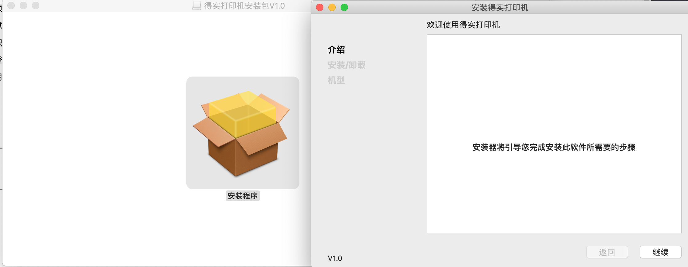

## 自我评价
1. 做事认真且仔细，善于总结生活和工作中的经验，能找出问题的关键所在.
2. 快速适应新的环境并掌握工作中的技能，很好地完成领导安排的工作.
3. 具有独立分析问题的能力、具有团队协作精神.
4. 热爱学习,对新事物有强烈的好奇心.
5. 能充分与客户交流需求,并解绝客户遇到的问题.
---

## 工作与学习经历
1. 2013-10月 -- 2014-4月 后台开发工程师 韶关房讯网
2. 2014- 5月 -- 2015-12月 后台开发工程师,微信平台管理 欣辉电器
3. 2016- 1月 -- 至今 iOS,Mac,后台开发工程师 广州得实有限公司
---
## 熟悉技能

### 网站开发
1. 熟悉 Java 编程语言以及了解 HTML,CSS, JavaScript 等前端语言.
2. 熟悉 JSP、Servlet、Listener、Filter、EL、JSTL、JavaMail 等 JavaWeb 软件编程技术.
3. 了解 SpringBoot, Spring MVC, Hibernate 等主流开发框架.
4. 熟悉 PHP编程语言并掌握热门TP框架.
5. 了解 Linux 操作系统以及 Nginx 代理服务器.
6. 熟悉 Vue框架进行前端开发.
7. 熟悉 Bootstrap,iViewUI框架.
8. 熟悉 NodeJs,npm,webpack并掌握热门express框架.
9. 熟悉 jQuery及多种插件的使用.
10. 使用composer管理php依赖包.

### 手机iOS开发,电脑Mac开发
1. 熟悉ObjectC,Swift 编程语言.
2. 熟练掌握iOS主流界面布局设计，基本控件和自定义控件的使用.
3. 熟练掌握MVC、单例、观察者、代理、工厂等设计模式.
4. 熟练掌握Json/XML解析等.
5. 熟练使用FMDataBase.
6. 熟悉iOS各种资源的应用、机型适配的原理及运用.
7. 熟悉地图定位，附近搜索，线路查寻，轨迹绘制和基于地图的高级自定义控件开发.
8. 熟练操作App上架及版本更新及企业APP发布.
9. 熟练使用SVN,git等代码管理工具.
10. 熟练使用第三方SDK(地图，支付等)及工具库.
11. 熟练掌握.a、.framework框架的封装调试，.bundle资源包的封装.
12. 熟悉各种打印机仿真ZPL,POS,ESC.
13. 熟悉多种图像算法,如误差扩散,二值法等.
14. cordova插件开发.
15. 熟悉蓝牙CoreBluetooth相关开发.
16. 熟悉TCP,UDP等协议.
17. 了解AirKiss协议,实现设备一键配网.
---

### 其他
1. 了解C++,golang等语言.
2. 熟练使用Photoshop,Xcode,VSCode,SourceTree,SVNStone,FileZilla,MS办公等软件.
3. 了解即时通讯.

## 项目经验

项目名称:得实iOSSDK及演示Demo开发

应用技术:Xcode + ObjectC

项目描述:
``` 
该项目主要是开发一个面对APP开发者使用的SDK,SDK主要功能是提供手机与APP之间的连接和打印数据.
客户使用SDK可以快速开发打印表格类型的账单,快递单,图像,文字等APP.

SDK为模块式设计,主要分为打印内容模块,连接模块,日志模块.

连接模块统一了蓝牙连接和WiFi连接,提供连接,断开,发送进度等接口.

打印内容模块则提供了不同打印仿真,其中包括ZPL,POS,ESC,基本囊括市面上的仿真类型,其中使用zlib对位图进行压缩,大大减小了图片的体积.
```

合作客户:商一通,厦门速订货,管家婆,歌莉娅,百丽,浪莎,蓝桥等知名企业.

职责描述:独立开发,需求收集整理,负责项目功能的设计与实现,从无到有地开发出整个SDK.

项目名称:CUPS打印驱动开发及安装程序

应用技术:Xcode + ObjectC

项目描述:MAC平台下的打印机驱动,适配多种打印机型号.
打印机连接电脑后,安装打印机时自动选择打印机型号和驱动,使客户安装过程更加方便.


职责描述:独立开发,根据CUPS编译多个PDD文件,利用shell进行文件安装

项目名称:发票打印工具

应用技术:Xcode + ObjectC

项目描述:

项目名称:卡片设计器

应用技术:Xcode + ObjectC

项目描述:

项目名称:房讯网韶关分站

应用技术:Dreamweaver + PHP + Flash

项目描述:房讯网是一家服务广大购房者、专注于房地产的专业地产门户网站，规模宏大，访问量、房产家居资讯全面的网络媒体.

职责描述:组员,主要负责看房预约模块.登记有意向看房的客户的相关信息,并根据看房时间进行短信群发提醒客户.
每周楼盘销售情况汇总模块,上传EXCEL表格,自动生成周报页面.
根据客户需求制作Flash广告.

项目名称:得实官网

应用技术:Eclipse + JAVA + springMVC

项目描述:得实集团官网。项目基于spring框架,全程采用面向对象的编程模式.后台的主要功能包括商品的管理.

职责描述:参与项目需求分析，参与数据库的设计、调优，负责产品上架逻辑代码编写。以及定期维护网站程序，处理反馈回来的系统bug.

项目名称:得实仿真协议

应用技术:XCode + C++, VSCode + PHP

项目描述:为了响应物联网时代潮流而升级打印机功,计步器,血糖仪的一套完整协议,主要包含了设备状态管理,设备信息获取,设备升级等功能,形成了 设备<->服务器<->用户 的一个完整物联系统,使得打印机等传统设备透过互联网扩大使用范围.

职责描述:参与定制得实仿真协议.
设备模块:设备注册,设备状态信息管理,设备固件更新.
用户管理：对用户进行增删查改，或者查看用户的设备，页面信息。

项目名称:欣辉电器

应用技术:ZendStudio + PHP

项目描述:欣辉电器作为新塘知名的电器销售商,从传统的线下服务扩展到网络销售.提供家电购买配送安装等服务

职责描述:服务器环境搭建,数据库设计,负责模块有登录，注册，忘记密码,个人中心,实时通讯,其中实时通讯是Webs网页弹框与客户进行对话,利用了Websocket技术,支付模块.商品录入.

---